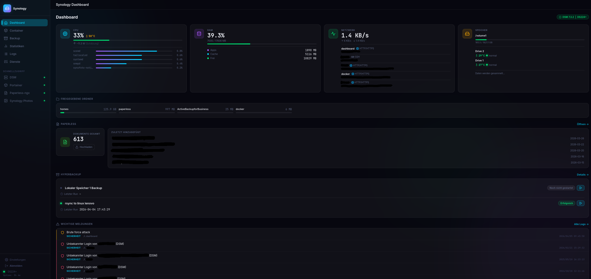

# Synology Dashboard

A self-hosted web dashboard for your Synology NAS — built with FastAPI, HTMX, and Chart.js.
Monitor system stats, manage Docker containers, track backups, browse logs, and more — all from one place.

> **⚠️ AI Generated** — This project was built with the assistance of an AI coding assistant.

---

## Features

- **System overview** — CPU, RAM, temperature, power estimate, network traffic
- **Storage** — Volume usage, shared folder sizes, storage growth charts
- **Docker containers** — List, start, stop, restart via Portainer or Docker socket
- **Backup monitoring** — HyperBackup task status and history
- **Logs** — DSM system log, security events, `/var/log/messages` (Syslog tab)
- **Disk health** — SMART status, temperature, SSD remaining life
- **Active sessions** — Who is currently connected to your NAS
- **Service management** — Configure all integrations (DSM, SSH, Portainer, Paperless, Photos, AdGuard) from the UI — no file editing required
- **Secure login** — First-time setup wizard, bcrypt-hashed credentials, session cookies

---

## Screenshots



---

## Requirements

- Synology NAS with DSM 7.x
- Docker + Portainer running on the NAS (or Docker socket access)
- A dedicated DSM user for the dashboard (see [NAS Setup](#nas-setup))

---

## Deployment via Portainer

### 1. Clone or upload the project

Upload the project folder to your NAS — for example to `/volume1/docker/synology-dashboard`.
over ssh: 
```bash
docker build -t synology-dashboard .
```

You can do this via File Station, SCP, or by cloning directly on the NAS:

```bash
cd /volume1/docker
git clone https://github.com/your-username/synology-dashboard.git
```

### 2. Create the environment file

In the project folder, create a `.env` file. This is where all secrets live — it is never included in the image.

```bash
cp .env.example .env
```

Or create it manually:

```env
SYNO_PASSWORD=your_dsm_password
SSH_PASSWORD=your_ssh_password

# Optional — only needed if using these integrations
PAPERLESS_TOKEN=your_paperless_api_token
PORTAINER_PASSWORD=your_portainer_password
```

> Passwords can alternatively be configured later through the dashboard UI at **Dienste → Konfigurieren**.

### 3. Review `config.yaml`

The `config.yaml` file holds non-secret settings. Open it and adjust:

```yaml
synology:
  host: "192.168.1.100"     # Your NAS IP
  port: 5001                 # 5001 = HTTPS, 5000 = HTTP
  username: "dashboard"      # DSM user (see NAS Setup below)
  use_https: true

ssh:
  host: "192.168.1.100"
  port: 22
  username: "dashboard"

dashboard:
  title: "Synology Dashboard"
  stats_interval_seconds: 60
  refresh_interval_seconds: 5
```

> All of these settings can also be changed later through the **Dienste** page in the dashboard UI.

### 4. Deploy via Portainer Stack

1. In Portainer, go to **Stacks → Add stack**
2. Choose **Upload** and select the `docker-compose.yml` from the project folder
   — or use **Git repository** if you cloned it
3. Set the **working directory** to the project folder path on your NAS
4. Click **Deploy the stack**

The dashboard will be available on port **8000** of your NAS:

```
http://your-nas-ip:8000
```

### 5. First-time setup

On first visit you will be redirected to the **setup wizard** — create your dashboard username and password. These credentials are stored securely (PBKDF2-SHA256) in the local SQLite database and have nothing to do with your DSM account.

After logging in, go to **Dienste** in the sidebar to configure or verify all service connections.

---

## NAS Setup

### Create a dedicated DSM user

It is strongly recommended **not** to use an admin account for the dashboard.

1. Go to **DSM → Control Panel → User & Group**
2. Create a new user, e.g. `dashboard`
3. Grant the following permissions:
   - **Administrators** group membership is NOT required
   - Required APIs work with a standard user + the permissions below

Minimum required DSM permissions:

| Permission | Why |
|---|---|
| Read-only access to **File Station** | Shared folder sizes |
| **System Information** viewer | CPU, RAM, temp stats |
| **HyperBackup** viewer | Backup task status |

### Enable SSH and grant sudo for syslog (optional)

The Syslog tab reads `/var/log/messages` via SSH. To enable this:

1. **DSM → Control Panel → Terminal & SNMP → Enable SSH service**
2. Add a sudoers rule for the dashboard user — SSH into the NAS as admin and run:

```bash
echo "dashboard ALL=(ALL) NOPASSWD: /usr/bin/tail" | sudo tee /etc/sudoers.d/dashboard-tail
```

> Without this, the Syslog tab will show a permission error. All other features still work.

---

## Network Mode

The `docker-compose.yml` uses `network_mode: host` by default. This means:

- The dashboard runs **directly on the host network** — no port mapping needed
- It can reach other local services (Portainer, Paperless, AdGuard) via `localhost` or the NAS IP
- The dashboard is accessible at `http://your-nas-ip:8000`

If you prefer bridge networking, change the compose file:

```yaml
services:
  dashboard:
    ports:
      - "8000:8000"
    # remove: network_mode: host
```

Note: with bridge mode, use the NAS LAN IP (not `localhost`) for all service URLs.

---

## Updating

```bash
cd /volume1/docker/synology-dashboard
git pull
```

Then redeploy the stack in Portainer (**Stacks → your stack → Update the stack → Redeploy**).

The SQLite database and all settings are stored in a named Docker volume (`dashboard-data`) and persist across updates.

---

## Data & Privacy

- All data stays **local** — no external services, no analytics, no telemetry
- Credentials are stored hashed in a local SQLite database (`data/dashboard.db`)
- The `.env` file is never baked into the Docker image
- Sessions expire after 8 hours

---

## Tech Stack

| Component | Technology |
|---|---|
| Backend | Python 3.12, FastAPI, uvicorn |
| Templates | Jinja2, HTMX |
| Charts | Chart.js |
| Icons | Feather Icons |
| SSH | Paramiko |
| Database | SQLite (via Python stdlib) |
| Container | Docker / Portainer API |

---

## License

MIT
